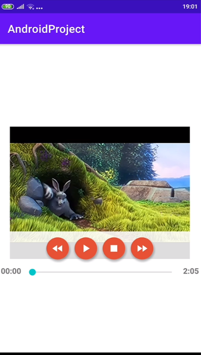
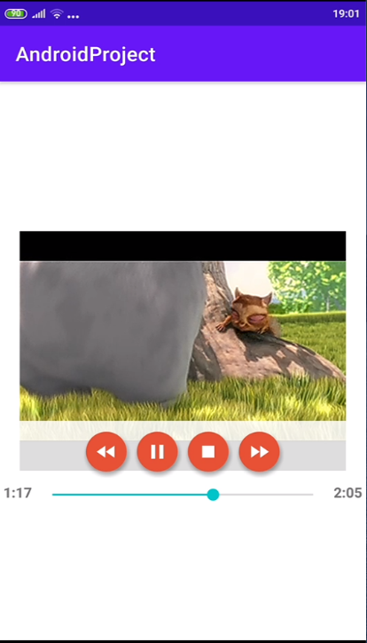
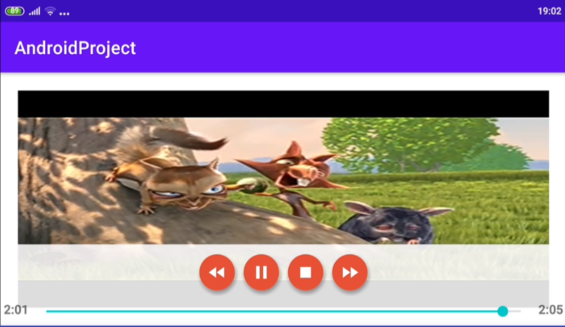

<p float="left">

<br>
</p>

# CustomVideoView

simple videoView with custom media controller, gesture handler for volume and more! implement it easily and add some video to your app quickly!<br>

# Download
## Requirement
```
minSdkVersion 23
```
## Repository
Add this in your root `build.gradle` file (**not** your module `build.gradle` file):
```
allprojects {
	repositories {
		...
		maven { url 'https://jitpack.io' }
	}
}
```
## Dependency
Add this to your module's `build.gradle` file (Note: version should match the jitpack badge above)
```
dependencies {
	implementation 'com.github.amit-kremer93:CustomVideoView:1.0.0'
}
```

# Usage
After implementation, add it to your.xml file with width and height:
```xml
<com.amit.videoplayer.UrlToVideo
        android:id="@+id/video"
        android:layout_width="match_parent"
        android:layout_height="300dp"
        android:layout_centerInParent="true"/>
```
Start use it:
```Java
private UrlToVideo mVideo = findViewById(R.id.video);
mVideo.setUrlToPlay("https://www.learningcontainer.com/wp-content/uploads/2020/05/sample-mp4-file.mp4");
```
#Gesture Handling
On the videoView, swipe right to increase volume and swipe left to decrease it

#Orientation Handling
When the phone is going into landscape mode, the video size changes automatically to match full screen
<p float="left">



</p>
